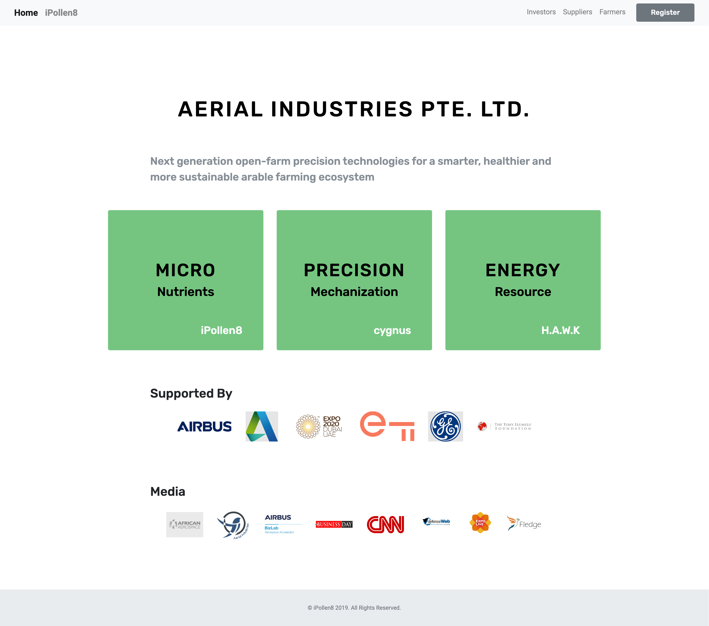

# iPollen8 Demo

## [Live Website](https://aerial.industries)

This is a visual demo of the iPollen8 project built with React and static data.

Built using the the [Webpack react minimal boilerplate](https://medium.com/@hashem.khalifa/minimal-webpack-and-react-starter-boilerplate-seriously-d90a673e134f)

## To get started with the project

After cloning this git repository, open your terminal, go into the folder and run `npm install` to install all dependencies.

### Development

Then run `npm start` and start making changes!

### Build and deployment

1. In command line, run `npm run build`.
2. Zip the `build` folder.
3. Log in to Bluehost and navigate to Cpanel. Find directory `public_html/aerial`.
4. Upload the `build.zip` file and extract the content so that the files are in `public_html/aerial`. (Make sure to move the files out of `/build` folder once extracted.)
5. And the webiste is live!
